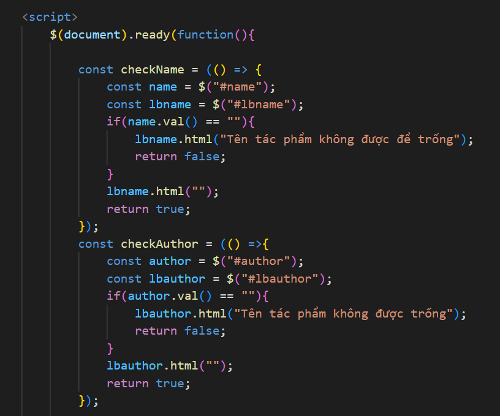
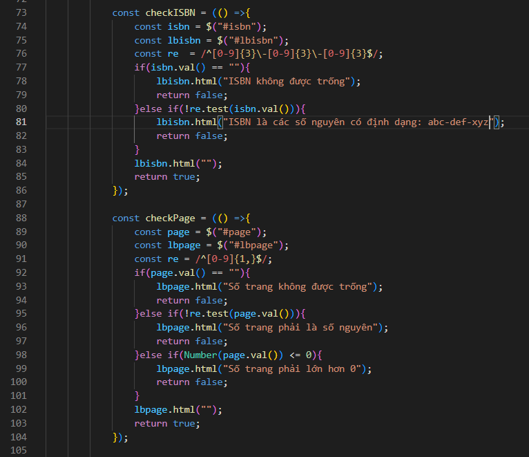
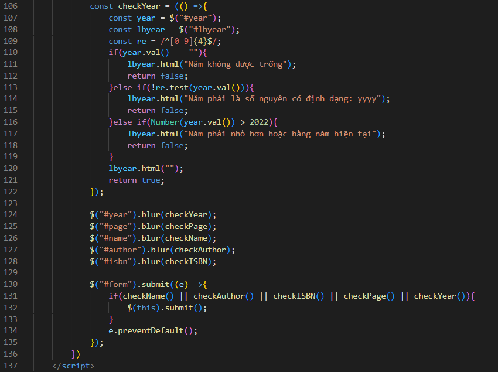

### Tài liệu thi giữa kì môn Công Nghệ mới NodeJS - AWS
- Sau khi clone, thực hiện các thao tác:
    + install projec
    + Tạo 1 file ".env"
    + Đặt tên các biến trong file .env tương tự hình bên dưới
    + Nhập SecretKey và AccessKey của AWS vào

- Project chạy trên Port 7979

    

        <h3>Giao diện project</h3>
    

    
    

    

        <h3>Validation form input</h3>
    

    
    
    

