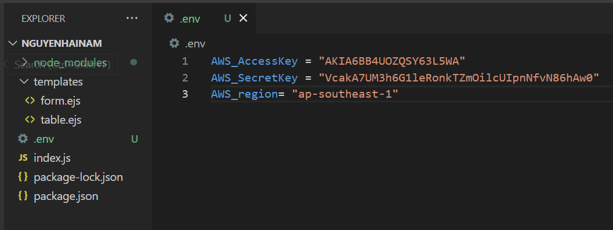
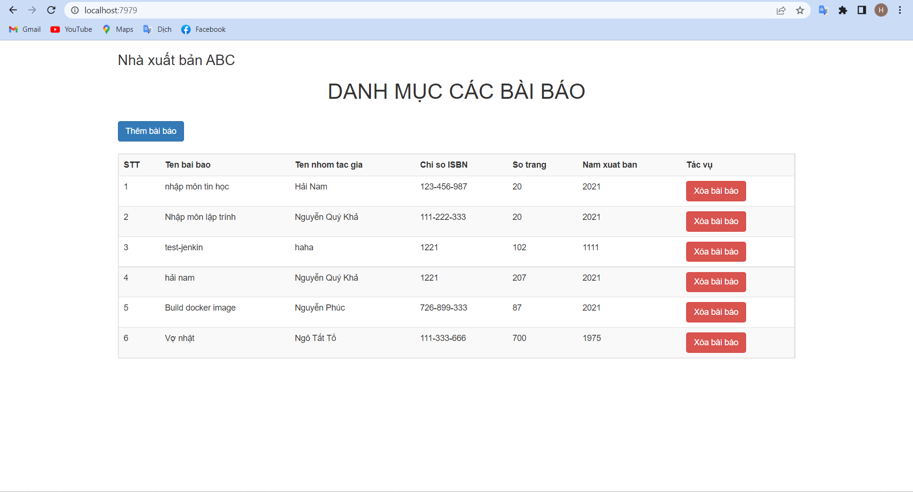
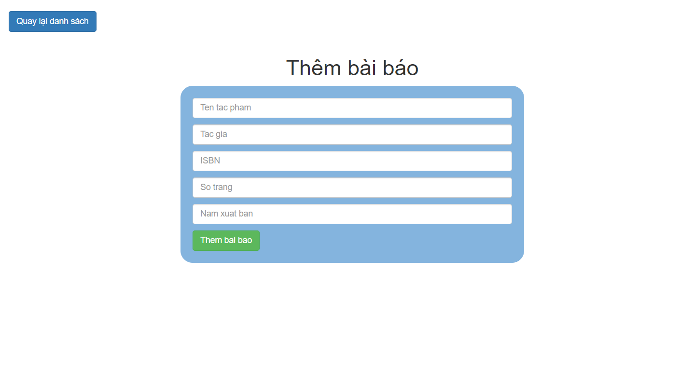

### Tài liệu thi giữa kì môn Công Nghệ mới NodeJS - AWS
- Sau khi clone, thực hiện các thao tác:
    + install projec
    + Tạo 1 file ".env"
    + Đặt tên các biến trong file .env tương tự hình bên dưới
    + Nhập SecretKey và AccessKey của AWS vào

- Project chạy trên Port 7979
<detail close>
    

        <h4>Giao diện project</h4>
    

    
    
</detail>

