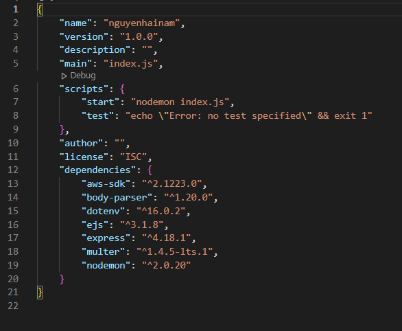
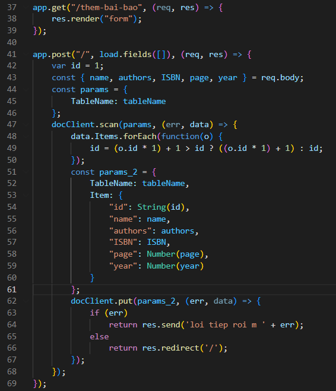
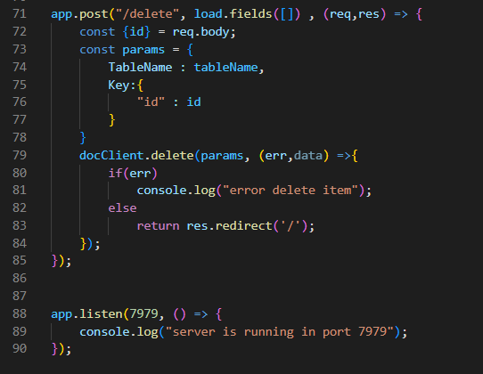
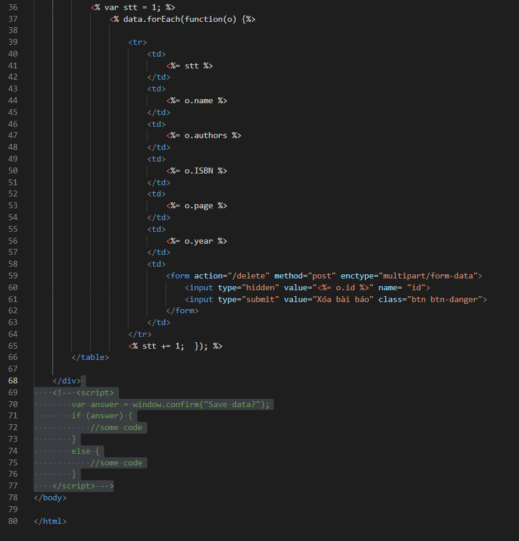
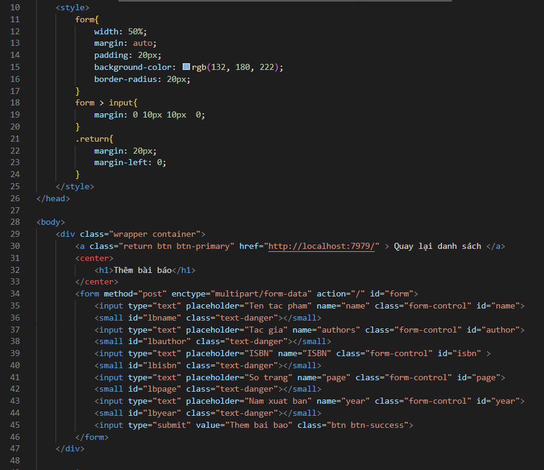

### Tài liệu thi giữa kì môn Công Nghệ mới NodeJS - AWS
- Project chạy trên Port 7979

    

        Install các thư viện
    

    

 

    

        Tạo file .env
    

    + Đặt tên các biến trong file .env
    + Nhập SecretKey và AccessKey của AWS vào
    + Hình minh họa
    

 

    

        <h3>Giao diện project</h3>
    

    
    

    

        <h3>File index.js</h3>
    

    
    
    

    

        <h3>File table.ejs</h3>
    

    
    

    

        <h3>Form input</h3>
    

    

    

        <h3>Validation form input</h3>
    

    
    
    

